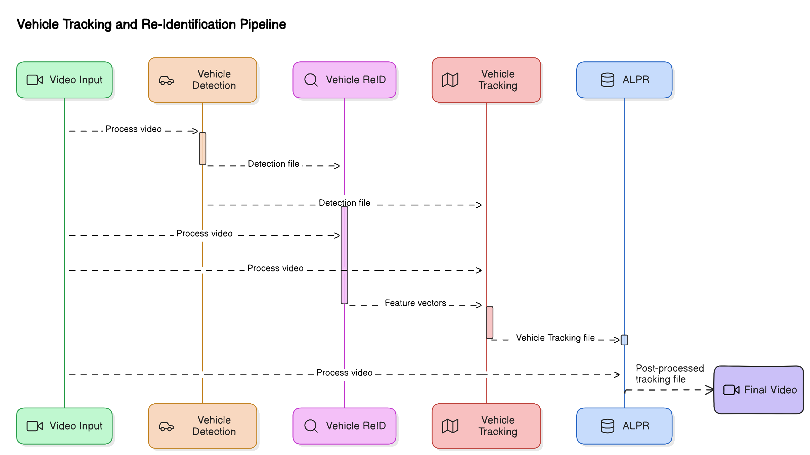

# Vehicle Tracking and Re-Identification (Vehicle_Tracking_Reid)

This repository contains the code for the project "Vehicle Tracking and Identification for Mobility Applications Using Computer Vision". The project aims to detect, track, and identify vehicles from video footage using advanced computer vision techniques.



## Project Pipeline
The steps to carry out the project, as shown in the pipeline, are:
1. Vehicle Detection
2. Vehicle Re-Identification
3. Vehicle Tracking
4. Automatic License Plate Recognition (ALPR)

## Data
The videos for tracking are available in the [UPC database](#).

## Preprocessing Video
To run the subsequent algorithms, video frames must be saved in a folder. In the `preprocess_video` directory, there are two scripts for this purpose:
- **Sequential Conversion**: Converts video frames sequentially.
- **Parallel Conversion**: Uses multiple CPUs to speed up the process.

The frames are saved in the `processed_frames` directory.

## Step 1: Vehicle Detection
This step generates a detection file with the following information for each detected vehicle:

 frame_number, class_id, bb_left, bb_top, bb_width, bb_height, 1, -1.0, -1.0, -1.0


## Step 2: Feature Extraction
This step extracts features from the videos and outputs them as a `.npy` file.

## Step 3: Vehicle Tracking with StrongSORT
This step uses the StrongSORT repository for vehicle tracking. To run it:
1. Update the paths in the `opts.py` file.
2. Download the AFLink weights from the [StrongSORT repository](https://github.com/dyhBUPT/StrongSORT).
3. Run the following command:
   ```sh
   python strong_sort.py MOT17 test
 and select the features you want to use (see opts.py).
and select the features you want to use (see opts.py). The tracking file will be saved in the results directory.

## Step 4: Automatic License Plate Recognition (ALPR)
1. Download the OpenALPR software from the OpenALPR releases page.
2. Run the license_plate_recognition.py script, specifying the required paths.
3. This will output the tracking file with the license plates of the vehicles.

# 5- View results.
To generate a video with the tracking information, run the following command:
```sh
python plot_bbox_ids --tracking_file --input_video --output_video